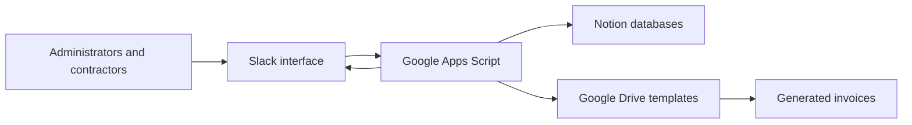
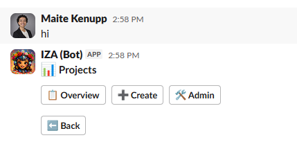
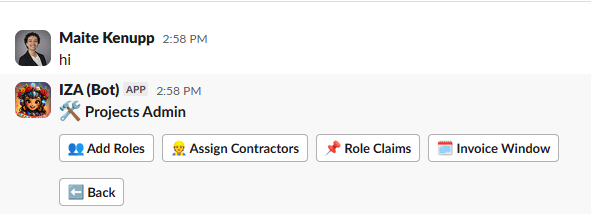

# Contractor Operations Slack Bot

A workflow automation system built with Google Apps Script that connects Slack, Notion, and Google Drive to streamline contractor staffing, project administration, time submission, and invoicing.

> **Project status:** Active development. Core project staffing and invoicing workflows are operational; reporting and contract-generation features are in progress.

## Project Overview

This project provides a guided Slack interface for managing contractor-based projects from initial staffing through invoice submission.

Users interact with the bot through a private Slack conversation. After starting the bot, they navigate a button-based menu displayed through a single message that updates as they move between workflows. This design allows administrators and contractors to complete structured processes without memorizing commands or switching repeatedly between systems.

## Business Problem

A marketing services company relied on manual processes to manage contractor-based projects.

When a new project arrived, administrators had to contact contractors individually, confirm their availability or interest, create the project in Notion, define roles, assign team members, allocate hours, and prepare supporting documents. Invoicing was also inconsistent: contractors used different formats, submission windows were not always followed, and information had to be entered and checked manually.

This fragmented process consumed administrative time, increased the risk of skipped steps and data-entry errors, and made operational and financial information harder to track.

## Solution

The bot creates a structured workflow inside Slack while using Notion as the central operational database and Google Apps Script as the automation layer.

It guides users through project creation, staffing, time submission, and invoicing while synchronizing the resulting information with Notion. Google Drive templates are used to generate consistently formatted invoice documents and store them in the appropriate location.

Early operational estimates indicate that the project creation and assignment process decreased from approximately 30 minutes to 5 minutes. The guided workflow has also substantially reduced skipped steps and manual data-entry errors.

## Features

### Project and staffing management

- Create projects in Notion through Slack
- Create roles within projects
- Assign contractors to project roles
- Announce open roles to contractors
- Allow contractors to claim available roles
- Allow administrators to review and confirm assignments
- Synchronize confirmed assignments with Notion

### Time submission and invoicing

- Allow administrators to open and close payment-submission windows
- Collect contractors’ worked hours through Slack
- Record submitted hours automatically in Notion
- Support calculations for billed, remaining, and pending-payment hours
- Populate standardized invoice templates with Notion data
- Save completed invoices using consistent names and folder locations
- Send contractors a submission confirmation and a copy of their invoice

### User experience

- Private, conversational Slack interface
- Button-based navigation
- A single interactive message that updates as users move through the menu
- Role-specific workflows for administrators and contractors

## Technologies

| Technology | Purpose |
|---|---|
| Google Apps Script | Application logic and workflow automation |
| Slack API | Interactive user interface, messages, buttons, and workflow events |
| Notion API | Project, role, assignment, hour, and invoice data management |
| Google Drive | Document-template and generated-invoice storage |
| Apps Script Properties Service | Environment configuration, credentials, and application state |

## Architecture



1. An administrator or contractor starts a workflow from the bot’s Slack conversation.
2. Slack sends the interaction to the Apps Script application.
3. Apps Script validates the user and executes the selected workflow.
4. Operational information is read from or written to Notion.
5. Document workflows retrieve templates from Google Drive and generate completed files.
6. The bot updates the interactive Slack message with the result or next action.

## Repository Structure

```text
google-apps-script-slack-bot/
├── README.md
├── .gitignore
├── examples/
│   └── 00_Config.example.js
├── images/
│   ├── main-menu.png
│   ├── projects-menu.png
│   └── projects-admin-menu.png
└── src/
    ├── appsscript.json
    └── *.js
```

- `src/` contains the sanitized public Google Apps Script source.
- `examples/00_Config.example.js` documents the required environment-specific configuration.
- Production IDs, credentials, company information, and internal debugging helpers are excluded from version control.
- The private production mirror used by clasp remains local and is not part of the public repository.

## Screenshots

### Interactive Slack menu

The bot starts from a private Slack conversation and presents a guided, button-based menu.


### Project navigation

Users can access project overviews, create projects, or enter the administrative workflow.



### Project administration

Administrators can manage roles, assign contractors, review role claims, and control invoice-submission windows.



## Installation

The repository contains sanitized source code and an example configuration. Deploying the bot requires Slack, Notion, Google Apps Script, and Google Drive resources configured for your own environment.

1. Clone this repository.
2. Copy `examples/00_Config.example.js` to `src/00_Config.js`.
3. Replace every placeholder with IDs from your own Slack, Notion, and Google Drive environment.
4. Store authentication tokens and other secrets in Apps Script Properties—not directly in source files.
5. Create or configure the required Notion data sources.
6. Create a Slack app and configure its permissions, events, and interactive components.
7. Create a Google Apps Script project and upload the contents of `src/`.
8. Deploy Apps Script as a web application.
9. Connect the Slack event and interaction endpoints to the web application URL.
10. Test access controls and workflows in a non-production Slack channel before broader use.

> Detailed Notion schema and Slack permission documentation is still in progress.

Real tokens, database identifiers, channel identifiers, folder identifiers, email addresses, and company-specific information are not included in this repository.

## Future Improvements

- Generate Statements of Work automatically for assigned projects
- Create summary views for active projects
- Add operational and financial reporting
- Improve project-level hour and budget visibility
- Expand automated validation and error handling
- Complete public setup and deployment documentation

## Business Impact

Based on early operational use, the system is expected to provide:

- Faster project creation and contractor assignment
- Less administrative effort across the company
- More consistent staffing and invoicing processes
- Fewer skipped steps and manual data-entry errors
- Standardized invoice documents and submission windows
- Centralized operational and financial information
- Better visibility into billed, remaining, and pending-payment hours

## Privacy and Security

This public repository uses anonymized examples and placeholder configuration values. Production identifiers, credentials, personal information, project details, contractor rates, invoice data, and company-specific records must remain outside version control.

The Apps Script web application uses anonymous access so Slack can deliver event and interaction callbacks. The current Apps Script-only implementation does not validate Slack’s request-signature headers.

Before using this architecture for sensitive production workflows, place a signature-verifying gateway—such as Google Cloud Run or Cloud Functions—in front of Apps Script. The gateway should validate Slack’s request signature and timestamp before forwarding an authenticated request to the application.

Application-level user and channel access controls should be treated as additional authorization checks, not as a substitute for authenticating the incoming Slack request.

## License

This project is licensed under the [MIT License](LICENSE).

Copyright © 2026 Maitê Kenupp.