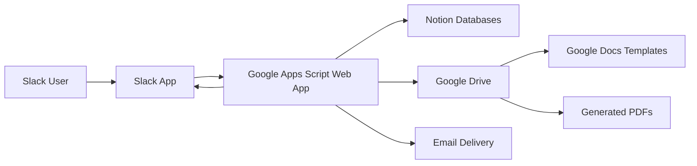
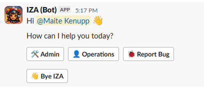
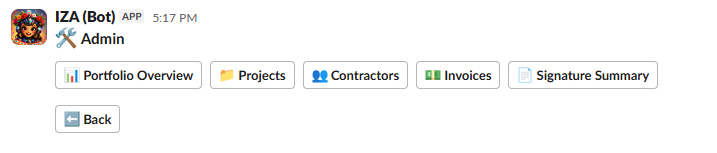
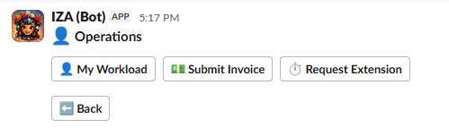

# Slack Operations Bot

This is a Slack-based operations assistant built with Google Apps Script. It connects Slack, Notion, Google Drive, Google Docs, and email to support project administration, contractor staffing, role claims, Statements of Work, invoice submission, workload reporting, signature tracking, and operational follow-ups.

> Project status: Active development. Core project, contractor, invoice, SOW, workload, extension request, and signature-tracking workflows are operational.

## Overview

The Slack bot gives administrators and contractors a guided Slack interface for completing operational workflows without switching constantly between Slack, Notion, Google Drive, Google Docs, and manual spreadsheets.

The bot uses Slack buttons, dropdowns, modals, and message updates to guide users through structured workflows. Notion acts as the source of truth for projects, clients, roles, contractor assignments, invoices, extension requests, and document status. Google Drive stores generated documents such as invoices, SOWs, amendments, and signed files.

## Business Problem

Contractor-based project operations often require many manual steps:

- Creating projects and clients
- Defining project roles
- Assigning contractors
- Announcing open roles
- Reviewing contractor claims
- Tracking workload and remaining hours
- Collecting monthly invoices
- Generating invoice PDFs
- Creating SOW and amendment documents
- Following up on pending signatures
- Updating project status and final billing

Before this bot, these workflows required manual coordination across Slack messages, Notion tables, Google Drive folders, and individual follow-ups. This created duplicated work, missed steps, inconsistent records, and limited operational visibility.

## Solution

The Slack bot centralizes these workflows inside Slack while keeping structured records in Notion.

Admins can create and manage projects, assign contractors, review role claims, track portfolio risk, manage invoice windows, generate SOWs and amendments, and monitor pending signatures.

Contractors can view their workload, submit invoices, request hour extensions, and claim open roles directly from Slack.

## Main Menu Structure

```text
Main Menu
|-- Admin
|   |-- Portfolio Overview
|   |-- Projects
|   |   |-- Projects Overview
|   |   |-- New Project
|   |   |-- New Client
|   |   |-- Add Roles
|   |   |-- Assign Contractors
|   |-- Contractors
|   |   |-- Contractor Workload
|   |   |-- Role Claims
|   |   |-- Extension Requests
|   |-- Invoices
|   |   |-- Invoice Window
|   |   |-- Invoice Summary
|   |-- Signature Summary
|
|-- Operations
|   |-- My Workload
|   |-- Submit Invoice
|   |-- Request Extension
|
|-- Report Bug
```

## Features

### Admin Workflows

#### Portfolio Overview

The bot provides an action-based portfolio dashboard to help admins quickly identify what needs attention.

Portfolio projects are grouped into:

- Needs Attention
- Watch This Week
- On Track
- Final Billing
- Pipeline

The dashboard considers project status, end dates, billed hours, remaining hours, missing SOW files, and other operational risk signals. Completed and canceled projects are filtered out of active portfolio views.

#### Projects Overview

Admins can view active projects grouped by status, including:

- Quotation
- Not Started
- Paused
- In progress
- For Review
- Final Billing
- Internal

Admins can also update project status from Slack with a review step before applying the change to Notion.

#### Project Creation

Admins can create a new project through Slack using guided steps. The bot collects project details, client, dates, status, links, roles, and contractor assignments before creating records in Notion.

#### Role Creation

Admins can add roles to new or existing projects. Role data includes company rate, contractor hours, client hours, deliverables, and CDEF logic where applicable.

#### Contractor Assignment

Admins can assign contractors directly or announce open roles for contractors to claim. Assigned roles are written to Notion and can trigger SOW generation.

#### Role Claims

Contractors can claim announced roles from Slack. Admins can review claims, assign roles to claimants, close announcements, and notify selected or unselected contractors.

#### Extension Requests

Contractors can request additional hours for existing assignments. Admins can approve, deny, or review extension requests from Slack.

Approved extensions can generate amendment documents and update assignment hours in Notion.

#### SOW and Amendment Documents

The bot can generate SOW and amendment drafts from Google Docs templates, finalize PDFs, attach them to Notion records, and track document status through Google Drive.

#### Signature Tracking

The signature summary monitors documents that are:

- Pending to send
- Awaiting signature
- Signed and updated in Notion

The bot can detect signed files from a Google Drive signature folder, update the related Notion records, and move completed documents into the signed-document folder.

#### Invoice Window Management

Admins can open and close monthly invoice submission windows. The bot posts announcements to the contractor channel and blocks invoice submissions outside the approved window.

When the window closes, the bot can summarize submitted invoices, total values, and contractors who missed the submission window.

### Contractor Workflows

#### My Workload

Contractors can view their assigned projects from Slack. The view includes In progress, Final Billing, and Internal projects.

For normal projects, the bot shows used hours, contracted hours, and remaining hours.

For internal projects without contracted hours, the bot displays open-ended billing values such as:

```text
Used: 45/- hrs | Remaining: -
```

Contractors can open a detail view for an assignment to review project and deliverable information.

#### Submit Invoice

Contractors can submit monthly invoices during the open invoice window.

The invoice flow:

1. Confirms saved payment information.
2. Shows available billable assignments.
3. Allows the contractor to enter hours and notes.
4. Supports multiple roles on one monthly invoice.
5. Generates an invoice record in Notion.
6. Creates a PDF invoice from a Google Docs template.
7. Emails the contractor a copy of the generated invoice.
8. Optionally allows the contractor to upload their own invoice file.

Invoice billing periods use the previous month. For example, an August invoice window bills July work and uses July 31 as the billing period.

#### Request Extension

Contractors can request more hours for an existing assignment. Pending, approved, denied, and canceled requests can be shown in the contractor flow.

#### Role Claims

Contractors can claim open roles posted in Slack. Admins review and assign claims separately.

## Technologies

| Technology | Purpose |
|---|---|
| Google Apps Script | Application logic, webhook handling, automation |
| Slack API | Menus, buttons, modals, messages, interactive workflows |
| Notion API | Operational database for projects, roles, contractors, invoices, claims, extensions |
| Google Drive | Template storage, generated PDFs, signed document storage |
| Google Docs | Invoice, SOW, and amendment document templates |
| Apps Script Properties Service | Runtime configuration, tokens, temporary workflow state |
| clasp | Local Apps Script development and deployment support |

## Architecture



## Repository Structure

```text
google-apps-script-slack-bot/
|-- README.md
|-- LICENSE
|-- .gitignore
|-- .clasp.json
|-- examples/
|   |-- 00_Config.example.js
|-- images/
|   |-- main-menu.png
|   |-- admin-menu.png
|   |-- operations-menu.png
|-- src/
|   |-- 01_MainWebhook.js
|   |-- Access_Control.js
|   |-- Slack_Api.js
|   |-- Slack_Blocks.js
|   |-- Slack_Router.js
|   |-- Project_Flow.js
|   |-- Role_Flow.js
|   |-- Contractor_Flow.js
|   |-- Claims_Admin_Flow.js
|   |-- Extension_Flow.js
|   |-- Invoice_Flow.js
|   |-- Invoice_Window.js
|   |-- Invoice_Documents.js
|   |-- Invoice_FileUpload.js
|   |-- SOW_Flow.js
|   |-- SOW_Documents.js
|   |-- SOW_HelloSign_Scanner.js
|   |-- Operations_WorkloadReport.js
|   |-- Operations_ContractorWorkload.js
|   |-- Notion_*.js
```

## Key Source Areas

| Area | Files |
|---|---|
| Slack entry point and routing | `01_MainWebhook.js`, `Slack_Router.js`, `Slack_Api.js`, `Slack_Blocks.js` |
| Access control | `Access_Control.js` |
| Project creation | `Project_Flow.js`, `Notion_Projects.js` |
| Clients | `Client_Flow.js`, `Notion_Clients.js` |
| Roles | `Role_Flow.js`, `Notion_Roles.js` |
| Contractor assignments and claims | `Contractor_Flow.js`, `Claims_Admin_Flow.js`, `Notion_Contractors.js` |
| Extension requests | `Extension_Flow.js` |
| Portfolio and workload reporting | `Operations_WorkloadReport.js`, `Operations_ContractorWorkload.js`, `Notion_CoreAndWorkload.js` |
| Invoices | `Invoice_Flow.js`, `Invoice_Window.js`, `Invoice_Documents.js`, `Invoice_FileUpload.js`, `Notion_Invoices.js` |
| SOWs and signatures | `SOW_Flow.js`, `SOW_Documents.js`, `SOW_HelloSign_Scanner.js` |
| Bug reports | `Bug_Report.js` |

## Screenshots

### Main Menu

The bot starts with a simple main menu that separates administrative workflows from contractor-facing operations.



### Admin Menu

The admin menu gives internal users access to portfolio reporting, project management, contractor workflows, invoice controls, and signature tracking.



### Operations Menu

The operations menu is focused on contractor self-service workflows, including workload review, invoice submission, and extension requests.



## Configuration

This repository does not include production credentials, database IDs, channel IDs, folder IDs, or private company information.

Configuration values should be stored in:

- `src/00_Config.js` for non-secret IDs and constants
- Apps Script Properties for secrets and tokens

Examples belong in:

```text
examples/00_Config.example.js
```

Sensitive values should not be committed.

## Installation

This repository contains sanitized source code. To deploy your own version:

1. Clone the repository.
2. Copy `examples/00_Config.example.js` to `src/00_Config.js`.
3. Replace placeholder IDs with your own Slack, Notion, and Google Drive values.
4. Store tokens in Apps Script Properties.
5. Create the required Notion databases and properties.
6. Create a Slack app with events, interactivity, bot scopes, and app mention access as needed.
7. Create a Google Apps Script project.
8. Push or paste the contents of `src/`.
9. Deploy Apps Script as a web app.
10. Connect the Slack event and interaction URLs to the Apps Script deployment URL.
11. Test in a private Slack channel before production use.

## Notion Data Sources

The bot expects Notion data sources for:

- Projects Overview
- Clients
- Tasks / Roles
- Projects by Contractor
- Team Directory
- Contractor Invoices
- Contractor Invoice Line Items
- Extension Requests
- Supporting operational tables

The exact schema is environment-specific and should be documented separately before public reuse.

## Security Notes

This project is designed for a controlled internal workspace.

Important security considerations:

- Store Slack, Notion, and other tokens in Apps Script Properties.
- Do not commit production IDs or secrets.
- Keep private Apps Script source separate from sanitized public source.
- Use internal role checks before allowing admin actions.
- Validate user access based on Slack UID and Notion Team Directory role.
- Apps Script web apps exposed to Slack should ideally be protected by a signature-verifying gateway.

The current Apps Script-only architecture may not validate Slack request signatures directly. For high-sensitivity deployments, use a gateway such as Cloud Run or Cloud Functions to validate Slack request signatures before forwarding requests to Apps Script.

## Current Capabilities

- Slack menu navigation
- Admin and contractor workflow separation
- Project creation and status management
- Client creation
- Role creation
- Contractor assignment
- Role announcements and claims
- Claim review and assignment
- Portfolio action dashboard
- Contractor workload reporting
- Contractor-facing workload view
- Invoice submission windows
- Invoice PDF generation
- Invoice email delivery
- Optional contractor invoice file upload
- SOW draft and PDF generation
- Amendment draft and PDF generation
- Signature status tracking through Google Drive
- Extension requests and amendment generation
- Bug reporting to an internal Slack channel

## Future Improvements

- Complete public Notion schema documentation
- Add automated tests for critical workflow helpers
- Improve setup documentation for Slack scopes and Notion permissions
- Add more robust Slack request verification
- Add richer contractor FAQ/help content
- Expand automated document lifecycle tracking
- Improve reporting exports for finance and operations

## Business Impact

The Slack bot reduces manual coordination and improves operational consistency by:

- Shortening project setup and staffing time
- Reducing skipped steps in project creation
- Standardizing contractor assignment workflows
- Making role claims easier to review
- Centralizing invoice submission and tracking
- Improving visibility into hours, remaining work, and final billing
- Keeping documents linked to operational records
- Giving admins a faster way to identify projects that need attention

## License

This project is licensed under the [MIT License](LICENSE).

Copyright 2026 Maite Kenupp.
